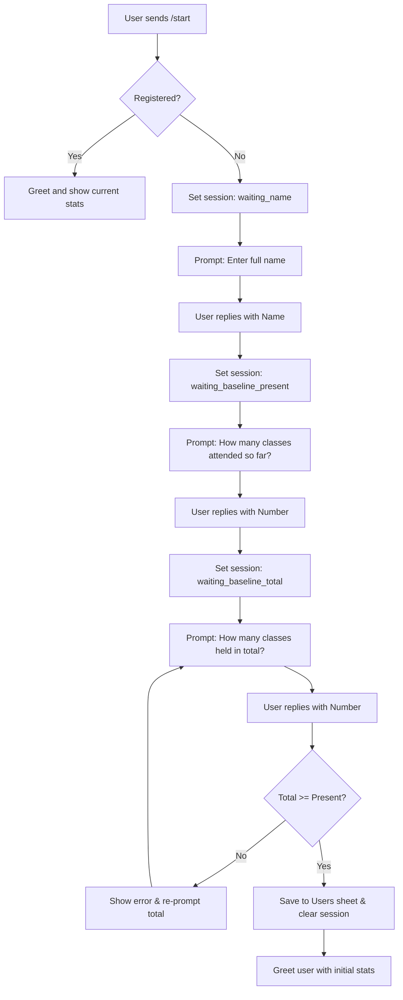
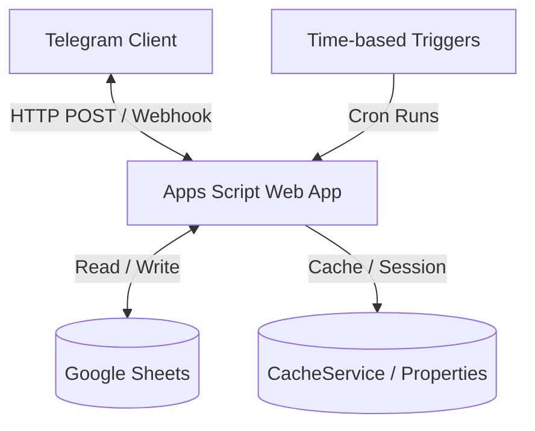

# Product Requirements Document (PRD) — AttendBuddy

## 1. Overview & Goal

AttendBuddy is a zero-cost, lightweight, automated attendance-tracking system designed to reduce student anxiety surrounding attendance thresholds. Built on **Google Apps Script**, **Google Sheets**, and the **Telegram Bot API**, it acts as a personal attendance assistant for students while offering group management capabilities for administrators.

The primary objective of AttendBuddy is to provide students with clear, actionable insights into their attendance status. Instead of manually counting classes or guessing their standing, students receive automated daily check-ins on Telegram. The system dynamically computes:
*   Their current cumulative term attendance percentage.
*   A forecast of their term and month-end attendance under different scenarios.
*   **Freedom Status**: The exact number of working days they can afford to skip (bunk) this month while remaining above the safe threshold.
*   **Recovery Plan**: If below the threshold, the number of consecutive classes they must attend to return to the safe zone.

---

## 2. User Roles & Permissions

AttendBuddy distinguishes between two user roles based on their Telegram Chat ID:

### 2.1 Student (Regular User)
*   **Onboarding**: Registers via the `/start` command, providing their full name and baseline attendance figures.
*   **Daily Check-in**: Responds to daily attendance prompts (Going, On the way, Not going).
*   **Self-Service Queries**:
    *   `/stats`: View progress meters, cumulative percentages, forecasts, and bunk/recovery stats.
    *   `/history`: View attendance logs for the last 30 days.
    *   `/holidays`: View the holiday calendar for the current month.
    *   `/correct`: Correct their attendance response for today.
    *   `/help`: View a list of student commands.

### 2.2 Administrator (Admin)
Admins are defined by a comma-separated list of Telegram Chat IDs stored in the `Config` sheet under the `ADMIN_IDS` key. In addition to all student features, Admins have access to:
*   **Settings Management (`/settings`)**: Customize the minimum attendance threshold and specify working days.
*   **Holiday Management (`/holiday`)**: Add or remove public/special holidays.
*   **Broadcast Announcements (`/broadcast`)**: Send announcements to all registered users.
*   **Monthly Group Summary (`/monthlystats`)**: Generate and optionally broadcast group-wide performance snapshots.

---

## 3. Product Features & Core Workflows

### 3.1 Registration & Onboarding Flow
When a new user sends `/start` to the bot, AttendBuddy initiates a structured onboarding process using a state machine persisted in the Apps Script `PropertiesService` (keyed by the user's `chat_id`).

### 3.2 Automated Daily Attendance Loop
AttendBuddy manages attendance collection automatically through three daily time-based triggers. All automated schedules are evaluated in the `Asia/Kolkata` timezone (IST).

1.  **Morning Check-in Prompt (08:30 AM IST)**
    *   Checks if today is a public holiday or a non-working day. If yes, the prompt is skipped.
    *   Loops through all registered users and sends an inline keyboard check-in message:
        *   `[✅ Going]` (callback: `att_present_<date>`)
        *   `[🚗 On the way]` (callback: `att_present_<date>`)
        *   `[❌ Not going]` (callback: `att_absent_<date>`)
    *   Implements a 50ms sleep between messages to respect Telegram's rate limit of 30 messages/second.
2.  **Reminder Nudge (09:15 AM IST)**
    *   Identifies users who have not yet responded to today's prompt.
    *   Sends a reminder warning that they will be auto-marked absent in 15 minutes.
    *   Includes inline keyboard buttons (`✅ Going` and `❌ Not going`).
3.  **Auto-Absent Sweep (09:30 AM IST)**
    *   Finds any users who still have no attendance record logged for today.
    *   Logs their status as `absent` in the `Attendance` sheet.
    *   Logs a `SYSTEM` audit event `AUTO_ABSENT`.
    *   Sends a notification informing the user that they have been marked absent and provides a correction shortcut (`/correct`).

### 3.3 Interactive Attendance Callbacks & Corrections
When a user taps an inline button (from the check-in prompt, nudge, or `/correct`), the bot handles the query via the webhook router:
*   **Date Verification**: Ensures the button tapped belongs to *today's* date. Taps on outdated messages show: *"This prompt is from a different day and can no longer be used."*
*   **Holiday Guard**: If a holiday was declared retroactively for today, block changes and notify: *"Today is a holiday — no attendance needed!"*
*   **Locking & Logging**: Writes the record to the `Attendance` sheet using `LockService` to prevent write collisions. Logs the event (`ATTENDANCE_MARKED` or `ATTENDANCE_CORRECTION`) in the `AuditLog`.
*   **Live Updates**: Updates the inline interaction and sends a confirmation message with the user's updated progress bar and forecasted monthly/term metrics.

### 3.4 Holiday & Calendar Management
Holidays are managed dynamically by Admins via `/holiday` commands:
*   **Calendar View**: `/holiday` displays weekly off days and public holidays for the current month.
*   **Removing Holidays**: `/holiday remove YYYY-MM-DD` deletes the specified holiday and logs the audit event.
*   **Adding Holidays**: `/holiday add [YYYY-MM-DD] [reason]`. If the date parameter is omitted, it defaults to today.
    *   **Retroactive Holiday Safe-Guard**: If an Admin declares today a holiday, the bot pauses to request confirmation: *"This will void any attendance already recorded for today and notify everyone."*
    *   Upon confirmation, it adds the holiday, deletes all attendance records for today, and broadcasts an alert to all registered users (tailored messages are sent to students who had already checked in vs. those who had not).

### 3.5 Settings Management
Admins customize behavior through `/settings` parameters:
*   `/settings` (or `/settings show`): Displays the current target threshold percentage and working days.
*   `/settings min <value>`: Sets the target threshold (e.g., `75`). Input must be a number between 1 and 100.
*   `/settings workdays <list>`: Sets the weekly working days (e.g., `1,2,3,4,5,6` for Mon–Sat, where `0` is Sunday and `6` is Saturday).
*   Any configuration changes invalidate the Config Cache and write an entry to the `AuditLog`.

### 3.6 Announcements & Monthly Summaries
*   **Custom Broadcasts**: Admins can issue `/broadcast <message>` to deliver announcements immediately to all users.
*   **Monthly Performance Summaries**: `/monthlystats` aggregates group stats for the current month:
    1.  Calculates term and monthly forecasts for all registered users.
    2.  Sorts users in descending order of their current term attendance percentage.
    3.  Highlights at-risk users who are falling below the minimum threshold.
    4.  Presents a private preview to the admin with inline options: `[📢 Yes — broadcast to all]` or `[🔒 No — keep private]`.
    5.  If broadcast is approved, it sends the full performance table to all registered users.

---

## 4. Technical Architecture & Database Design

### 4.1 Technology Stack
*   **Runtime Environment**: Google Apps Script
*   **Database Engine**: Google Sheets API (SpreadsheetApp bindings)
*   **Communication Protocol**: HTTPS / Telegram Bot API Webhook
*   **State Management**: Apps Script PropertiesService (onboarding state machine)
*   **Cache Store**: Apps Script CacheService (used for configuration parameters)

### 4.2 Database Schema (Google Sheets)

The active Google Spreadsheet contains five relational tables. Columns are initialized with specific color codes and header formatting during the execution of the `onInstall` script.

#### 1. Sheet: `Users` (Header Color: Blue `#4285F4`)
Stores user profiles, onboarding metadata, and baseline calibration values.
| Column Name | Data Type | Description |
| :--- | :--- | :--- |
| `chat_id` | String | Unique Telegram identifier for the user |
| `name` | String | Full name provided during onboarding |
| `join_date` | Date / String | YYYY-MM-DD date when the user completed onboarding |
| `is_admin` | Boolean | True if user has administrative rights |
| `baseline_present` | Number (Integer) | Total classes attended prior to bot registration |
| `baseline_total` | Number (Integer) | Total classes held prior to bot registration |

#### 2. Sheet: `Attendance` (Header Color: Green `#34A853`)
Stores daily attendance records logged after registration.
| Column Name | Data Type | Description |
| :--- | :--- | :--- |
| `chat_id` | String | References `Users.chat_id` |
| `date` | Date / String | YYYY-MM-DD representing the class day |
| `status` | String | Enum: `'present'`, `'absent'`, or `'holiday'` |
| `marked_at` | Timestamp | ISO 8601 string of when the row was recorded |

#### 3. Sheet: `Holidays` (Header Color: Yellow `#FBBC04`)
Tracks weekly off days and declared holidays.
| Column Name | Data Type | Description |
| :--- | :--- | :--- |
| `date` | Date / String | YYYY-MM-DD representing the holiday |
| `reason` | String | Description of the holiday |
| `added_by` | String | Telegram `chat_id` of the admin who added it |

#### 4. Sheet: `Config` (Header Color: Red `#EA4335`)
Stores core system key-value configurations.
| Column Name | Data Type | Description |
| :--- | :--- | :--- |
| `key` | String | Settings identifier (e.g. `BOT_TOKEN`, `MIN_PERCENT`) |
| `value` | String | Configuration value |

#### 5. Sheet: `AuditLog` (Header Color: Purple `#9334E6`)
An immutable log capturing actions taken by users, admins, and the system trigger.
| Column Name | Data Type | Description |
| :--- | :--- | :--- |
| `timestamp` | Date/Timestamp | Date and time the action occurred |
| `actor_chat_id` | String | Telegram `chat_id` or `'SYSTEM'` |
| `action` | String | Log type (e.g. `ATTENDANCE_MARKED`, `HOLIDAY_ADDED`, `SETTING_CHANGED`) |
| `target` | String | Target identifier (e.g. chat_id or YYYY-MM-DD date) |
| `details` | String | Verbose details about the modification |

---

## 5. Logic & Calculation Rules

The statistics calculation in `stats.gs` uses pure arithmetic. To avoid performance degradation due to sheet reads, calculations utilize parameters extracted from the user profile baseline and daily logs.

### 5.1 Definitions & Bounds
*   `joinDate`: The date of registration. The onboarding baseline covers all class activities up to and including this date.
*   `firstTrackedDate`: The calendar day immediately following registration (`joinDate + 1`). This is the start date for calculating log records.
*   `elapsedThrough`: The final day of the evaluated period. A day is not considered elapsed until it is resolved.
    *   If today is a weekend or holiday: Today is resolved. `elapsedThrough` = today.
    *   If today is a working day, and the user has already responded (or it is past the 9:30 AM sweep): Today is resolved. `elapsedThrough` = today.
    *   Otherwise: Today is not resolved. `elapsedThrough` = yesterday.
*   `remainingStart`: The first day of the forecasted period.
    *   If today is resolved: `remainingStart` = tomorrow.
    *   If today is not resolved: `remainingStart` = today.

### 5.2 Stat Calculations
*   **Elapsed Classes This Month ($E_{month}$)**:
    $$E_{month} = (\text{joined\_this\_month} ? \text{baseline\_total} : 0) + \text{CountWorkingDays}(\text{trackedStart}, \text{elapsedThrough})$$
*   **Classes Attended This Month ($P_{month}$)**:
    $$P_{month} = (\text{joined\_this\_month} ? \text{baseline\_present} : 0) + \text{CountPresentLogs}(\text{trackedStart}, \text{elapsedThrough})$$
*   **Monthly Attendance Percentage ($Att_{month}$)**:
    $$Att_{month} = \frac{P_{month}}{E_{month}} \times 100 \quad (\text{rounded to 1 decimal place; defaults to } 100\% \text{ if } E_{month} = 0)$$
*   **Remaining Classes this Month ($R_{month}$)**:
    $$R_{month} = \text{CountWorkingDays}(\text{remainingStart}, \text{monthLastDay})$$
*   **Total Month-End Classes ($M_{total}$)**:
    $$M_{total} = E_{month} + R_{month}$$
*   **Month-End Forecast Percentage ($Att_{forecast}$)**:
    Assuming the user attends 100% of the remaining classes in the current month:
    $$Att_{forecast} = \frac{P_{month} + R_{month}}{M_{total}} \times 100$$
*   **Required Future Attendance ($P_{required}$)**:
    The minimum number of future classes the user must attend to meet the target threshold ($Target\%$) by the end of the month:
    $$P_{required} = \max\left(0, \left\lceil \frac{Target \times M_{total} - 100 \times P_{month}}{100} \right\rceil\right)$$
*   **Skippable Days ($Bunks_{allowed}$)**:
    The number of classes the user can safely skip (bunk) this month while maintaining an attendance percentage $\ge Target\%$ at month-end:
    $$Bunks_{allowed} = \max(0, R_{month} - P_{required})$$
*   **Recovery Classes ($Recovery$ - Month-based)**:
    If the current attendance percentage is below the target threshold, the number of consecutive classes the user must attend *starting immediately* to bring their monthly attendance back to the target:
    $$Recovery = \max\left(0, \left\lceil \frac{Target \times E_{month} - 100 \times P_{month}}{100 - Target} \right\rceil\right)$$

---

## 6. Key Technical Integration Patterns

### 6.1 Webhook Performance & Retries
Telegram expects webhooks to return a `200 OK` status within 5 seconds. Google Apps Script cold starts can exceed this window, causing Telegram to repeat failed POST requests and generate duplicate records. AttendBuddy solves this with two patterns:
1.  **Early Content Flushing**: The webhook handler checks the query parameter secret and immediately returns an empty response (flushing a standard status code) before executing the business logic in `processUpdate(update)`.
2.  **Script Cache Deduplication**: Incoming payloads are checked against a script cache (`CacheService.getScriptCache()`) using the unique `update_id` as the key. If the `update_id` has already been processed within the last 10 minutes, the request is discarded immediately.

### 6.2 Database API Optimization
Reading and writing from Google Sheets cells inside loops degrades execution performance and risks hitting Google API limits.
*   **Config Cache**: Configuration values are cached using `CacheService` in a JSON block for 120 seconds. Standard API read operations fetch from the cache first. Any update writes back to the Google Sheet and immediately invalidates the cache (`_bustConfigCache()`).
*   **Bulk Reads**: Operations such as `/monthlystats` extract user data using range values (`getDataRange().getValues()`) to load sheets into memory once, performing sorting and lookups in standard JavaScript loops.

### 6.3 Secure Webhook Communication
To prevent malicious parties from spoofing Telegram events to the web app:
*   A cryptographically random UUID is generated during first-time setup and saved as `WEBHOOK_SECRET` in the config sheet.
*   The webhook URL registered with Telegram includes the secret as a query string parameter: `.../exec?secret=WEBHOOK_SECRET`.
*   The `doPost(e)` dispatcher checks the query string and immediately drops payloads that do not match the expected secret.

---

## 7. Performance & Operational Thresholds
*   **Student Cap**: Optimized for groups of up to 100 students (e.g., a standard college batch/classroom).
*   **Rate Limits**: The message broadcast mechanism handles bulk transmissions by implementing a 50ms sleep between individual sends, conforming to the Telegram API limit of 30 messages/second.
*   **Execution Window**: Apps Script time-driven triggers execute within ±15 minutes of the scheduled time. Daily cron trigger parameters are seeded in Google settings.
