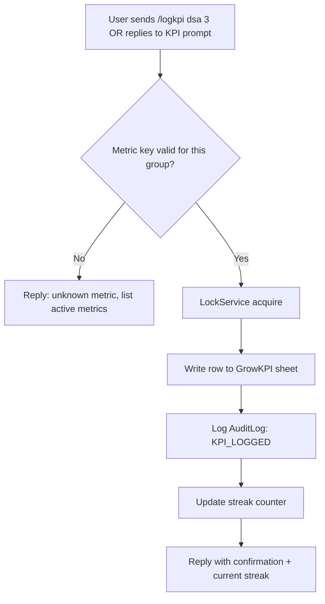
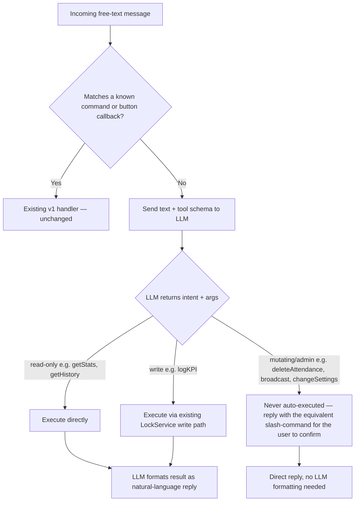
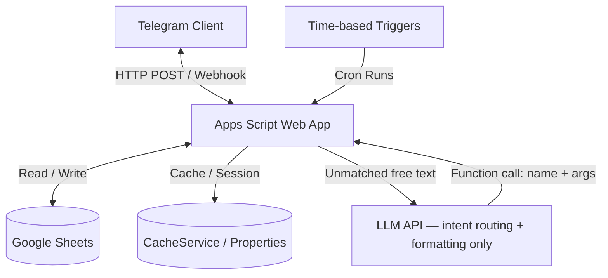

# Product Requirements Document (PRD) — AttendBuddy v2

## 1. Overview & Goal

AttendBuddy is a zero-cost, lightweight, automated attendance-and-growth-tracking system designed to reduce student anxiety around attendance thresholds while also helping students build consistent study habits. Built on **Google Apps Script**, **Google Sheets**, and the **Telegram Bot API**, it acts as a personal accountability assistant for students while offering group management capabilities for administrators.

**v2 extends the original attendance-only scope in two directions:**

1. **GrowKPI** — a parallel tracking layer for personal growth metrics (DSA problems solved, study hours, mock scores, etc.), logged alongside attendance so students can see how their *effort* correlates with their *presence*.
2. **Natural-Language Agent Layer** — a conversational interface on top of the existing structured commands, letting users ask questions and log data in plain English instead of memorizing slash-commands, while all data-mutating actions still route through the original locked, audited write paths.

The primary objective remains: give students clear, actionable insight into their own numbers — automatically, daily, without manual tracking — and now across both attendance and personal growth.

---

## 2. User Roles & Permissions

Roles are unchanged in structure from v1, with new capabilities layered in.

### 2.1 Student (Regular User)
*   **Onboarding**: `/start` — provides full name and baseline attendance figures (unchanged).
*   **Daily Check-in**: Responds to daily attendance prompts (Going, On the way, Not going), now optionally followed by a one-line KPI prompt (e.g. "Solved any DSA today?").
*   **Self-Service Queries**:
    *   `/stats` — attendance progress, forecasts, bunk/recovery stats (unchanged)
    *   `/history` — last 30 days of attendance (unchanged)
    *   `/holidays` — holiday calendar (unchanged)
    *   `/correct` — correct today's attendance (unchanged)
    *   `/logkpi <metric> <value>` — **new**: log a growth metric (e.g. `/logkpi dsa 3`)
    *   `/growthstats` — **new**: view KPI streaks, weekly totals, and progress toward personal targets
    *   Free-text chat — **new**: ask questions or log data in natural language (see §3.7)
    *   `/help` — list of student commands

### 2.2 Administrator (Admin)
All v1 admin features unchanged, plus:
*   **KPI Target Management**: extend `/settings` to set default KPI targets (e.g. `KPI_TARGET_dsa`)
*   **KPI Leaderboard Broadcast**: extend `/monthlystats` with an opt-in KPI leaderboard, separate from the attendance summary (see §3.8 — opt-in only, since KPI data is more personal than attendance)

---

## 3. Product Features & Core Workflows

### 3.1 Registration & Onboarding Flow
Unchanged from v1 — see original state machine (`/start` → name → baseline present/total → save). No change needed; `GrowKPI` requires no baseline calibration since it has no historical carry-over the way attendance percentages do.

### 3.2 Automated Daily Attendance Loop
Unchanged core mechanics (8:30 AM prompt, 9:15 AM nudge, 9:30 AM auto-absent sweep). **New optional extension:**

*   **KPI Follow-up Prompt (immediately after a student responds to the attendance check-in)**
    *   Only fires if the student has at least one active KPI metric configured (via `/logkpi` history or an admin default).
    *   Sends a single lightweight inline prompt: *"Log today's DSA count?"* with quick-reply buttons for common values (0 / 1–2 / 3+) plus a "type a number" fallback.
    *   Skipped entirely for students who have never used `/logkpi` — this stays opt-in, not forced, to avoid turning the bot into a nagging habit tracker.

### 3.3 Interactive Attendance Callbacks & Corrections
Unchanged from v1 (date verification, holiday guard, `LockService` locking, audit logging).

### 3.4 Holiday & Calendar Management
Unchanged from v1.

### 3.5 Settings Management
Extended with KPI-related keys, using the exact same pattern as `MIN_PERCENT` and `WORKDAYS`:
*   `/settings kpitarget <metric> <value>` — sets a default daily/weekly target for a metric (e.g. `/settings kpitarget dsa 3`)
*   `/settings kpimetrics <list>` — defines which metric keys are active for the group (e.g. `dsa,study_hours`)
*   Config Cache invalidation and `AuditLog` entry (`SETTING_CHANGED`) — identical mechanism to v1, no new pattern introduced.

### 3.6 Announcements & Monthly Summaries
`/monthlystats` extended with an optional second section:
*   **KPI Leaderboard (opt-in)** — only includes students who have explicitly enabled `kpi_public: true` on their profile (new `Users` column, default `false`). Attendance data remains as in v1 (visible to admins by default per existing behavior); KPI data requires explicit opt-in given its more personal nature.

### 3.7 GrowKPI Tracking (New)

**Purpose:** Track effort/output metrics (not just presence) so students and admins can see whether attendance correlates with actual study output — something the original single-signal design couldn't surface.

**Core workflow:**

**Streaks:** computed on read (not stored) by scanning `GrowKPI` rows for the user/metric pair, walking backwards from today until a gap is found. No new state needed beyond the sheet itself.

**Correlation view (`/growthstats`):** shows, side by side for the current month:
*   Attendance % (from existing `Attendance` sheet)
*   KPI totals per active metric (from `GrowKPI`)
*   A simple flag if attendance dropped >10 points in a week where KPI logging also dropped to zero — a lightweight heuristic, not a statistical claim, framed as "worth noticing" rather than a diagnosis.

### 3.8 Natural-Language Agent Layer (New)

**Purpose:** Let users interact via free text ("how many days can I skip this month", "solved 4 DSA and studied 2 hours today") instead of memorizing commands, without weakening the data-integrity guarantees the v1 design already has.

**Design principle — LLM as router/formatter, never as writer:**
The LLM is never given direct write access to any sheet. It classifies intent and extracts structured arguments; your existing Apps Script functions perform the actual read/write, exactly as they do today for button callbacks.

**Guardrails (deliberately conservative):**
*   **Read-only queries and personal KPI logging** are the only actions the NL layer can trigger automatically — matches the "student self-service" surface, not the admin surface.
*   **Admin actions** (`/broadcast`, `/settings`, holiday changes, attendance corrections) are never triggered by free text, even from an admin's chat — the bot replies with the exact slash-command to run instead. This keeps the blast radius of a misparse limited to "wrong number logged," not "holiday deleted" or "wrong broadcast sent."
*   **Function-calling / structured output**, not open text parsing — the LLM must return one of a fixed set of function names with typed arguments; anything it can't map to a known function gets a fallback "I didn't catch that — try `/help`" reply rather than a guess.

**Model/provider choice:** given the zero-cost constraint already established for this project, a free-tier LLM API called via `UrlFetchApp.fetch()` (same mechanism already used for the Telegram webhook) fits without adding infrastructure. At ~80 users doing occasional NL queries, request volume stays well within typical no-card free tiers. Pick one provider, keep the call single-turn (one request/response per message) to stay inside Apps Script's execution window, and cache the tool schema/system prompt as a script constant rather than rebuilding it per call.

---

## 4. Technical Architecture & Database Design

The LLM sits *beside* the existing dispatcher, not inside the write path — `Sheets` is only ever touched by Apps Script functions, matching v1's data-integrity model.

### 4.1 Technology Stack
Unchanged from v1, plus:
*   **NL Layer**: Free-tier LLM API (provider TBD at implementation time — evaluate current no-credit-card options, since free-tier terms shift frequently), called via `UrlFetchApp.fetch()`

### 4.2 Database Schema (Google Sheets)

Five original tables unchanged (`Users`, `Attendance`, `Holidays`, `Config`, `AuditLog` — see v1 §4.2 for full column definitions). Two changes:

**`Users` — one new column:**
| Column Name | Data Type | Description |
| :--- | :--- | :--- |
| `kpi_public` | Boolean | **New.** Opt-in flag for inclusion in the KPI leaderboard broadcast. Default `false`. |

**New Sheet: `GrowKPI` (Header Color: Teal `#00ACC1`, to visually distinguish from the five original tables)**
| Column Name | Data Type | Description |
| :--- | :--- | :--- |
| `chat_id` | String | References `Users.chat_id` |
| `date` | Date / String | YYYY-MM-DD |
| `metric_key` | String | e.g. `dsa`, `study_hours`, `mock_score` — kept as key-value rather than one column per metric so new metrics don't require schema migrations |
| `value` | Number | Raw value logged for that metric on that date |
| `source` | String | `'manual'` (typed), `'button'` (quick-reply), or `'nl'` (parsed from free text) — useful for auditing NL-layer accuracy after launch |

Same `onInstall` header-formatting pattern as the original five sheets.

---

## 5. Logic & Calculation Rules

### 5.1–5.2 Attendance Calculations
Unchanged from v1 — see original §5.1–5.2 for `elapsedThrough`, `E_month`, `P_month`, forecast, required attendance, skippable days, and recovery formulas. None of this changes; `GrowKPI` is additive, not a replacement.

### 5.3 GrowKPI Calculations (New)

*   **Streak($metric$)**: walk backwards day-by-day from today through `GrowKPI` rows for `(chat_id, metric_key)`; stop at the first day with no logged row (or a logged value of 0, if the metric is configured as "any non-zero counts"). Return the count of consecutive qualifying days.
*   **Weekly Total($metric$)**: sum of `value` for `(chat_id, metric_key)` where `date` falls in the current ISO week.
*   **Target Progress**: $\dfrac{\text{Weekly Total}}{\text{KPI\_TARGET\_}metric \times 7} \times 100$, capped at display as "≥100%" once exceeded, avoiding a false sense of an exact ceiling.
*   **Attendance/KPI Correlation Flag**: for the current month, if week-over-week attendance % drops by more than 10 points *and* the corresponding week's KPI logging total is zero for all active metrics, surface a soft flag in `/growthstats` — phrased as an observation, not a diagnosis (e.g. "Your attendance dipped this week and no DSA was logged — worth checking in with yourself.").

---

## 6. Key Technical Integration Patterns

### 6.1 Webhook Performance & Retries
Unchanged from v1 (early content flushing, script-cache deduplication on `update_id`). **New consideration for the NL layer**: LLM API calls add latency. Keep the early-flush pattern in place so Telegram's 5-second webhook window is respected regardless of LLM response time — the LLM call happens inside `processUpdate()`, after the response has already been flushed.

### 6.2 Database API Optimization
Unchanged from v1 (Config Cache, bulk reads via `getDataRange().getValues()`). `GrowKPI` reads for `/growthstats` and streak calculation should follow the same bulk-read-once pattern rather than per-row `getRange()` calls in a loop.

### 6.3 Secure Webhook Communication
Unchanged from v1 (`WEBHOOK_SECRET` query-param check on `doPost`).

### 6.4 NL Layer Integration Pattern (New)
*   **Fixed tool schema**: define the callable functions (`getStats`, `getHistory`, `logKPI`, `getGrowthStats`) once as a script constant; pass this schema to the LLM on every unmatched-text request so it can only return calls from this known set.
*   **No conversation memory across sessions**: each free-text message is handled independently, with only the current message and tool schema sent to the LLM — no need to persist chat history, keeping Apps Script's stateless-per-call model intact and avoiding extra `PropertiesService` usage.
*   **Fallback on ambiguity**: if the LLM's returned function name isn't in the known set, or required arguments are missing, reply with a plain "I didn't catch that — try `/help`" rather than guessing or re-prompting the LLM.

---

## 7. Performance & Operational Thresholds

Unchanged from v1 (100-student cap, 50ms broadcast sleep, ±15 min trigger window), plus:
*   **NL Layer Latency**: budget the LLM call within Apps Script's total execution ceiling (6 minutes per execution, but realistically the NL response should return well under 5–10 seconds to keep the interaction feeling responsive); if a free-tier provider's response is slow or rate-limited, fail gracefully to "Sorry, I couldn't process that right now — try `/help` for commands."
*   **NL Layer Rate Limits**: free-tier LLM APIs cap requests per day/minute. At the ~80-student scale this project targets, typical no-card free tiers comfortably cover expected NL query volume, but the fallback path (plain command list) should always work even if the NL layer is temporarily unavailable — the bot should never become *unusable* if the LLM call fails.
